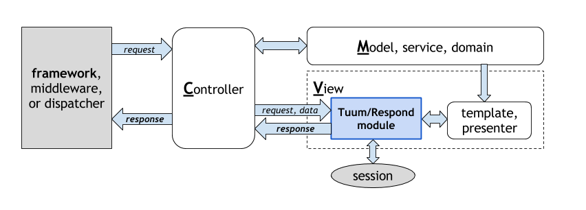

Tuum/Respond
=========

If a full-stack framework is for MVC (Model-View-Controller) pattern,
and if a micro-framework is for C (Controller, or routing and dispatching), 
then `Tuum/Respond` is a module for V (View) to help creating 
a PSR-7 response object. 

### View is more than just a template engine

Most of a typical HTML web site need to:  

- show flash messages saved in session after redirect, 
- retrieve csrf token in template pages,
- show previous input values and validation errors after form validation, 
- respond error pages like not-found, 

and more. 

`Tuum/Respond` module provides functionality to help 
 implement these operations that are often available 
 only in full-stack frameworks. 

### Who needs `Tuum/Respond`?

`Tuum/Respond` is a **module**, not a framework. 
It is designed to 
work with existing PSR-7 based micro-frameworks, 
such as Slim3 or Expressive. 

> we do not need yet-another framework :). 

Thus, `Tuum/Respond` is for people who uses PSR based micro-frameworks, 
yet wants/needs to develop a traditional html based web sites.  

About This Package
-----

### License

*	MIT license

### PSR

*   PSR-1, PSR-2, PSR-4, PSR-7, PSR-15, and PSR-17.


Installation
-------

### Installation

Please use the composer to install `Tuum/Respond`; 

```sh
$ composer require "tuum/respond:^4.0"
```

### Demo

The repository includes a sample site to demonstrate what `Tuum/Respond` can do.
To see the site;

1. run `composr create-project "tuum/respond" [proj-dir] "^4.0"`
1. change directory to `[proj-dir]`
1. run `composer install`,
2. change directory to `/public`,
3. run `php -S localhost:8000 index.php`, and
4. access `localhost:8000` via browser.


Basic Usage
===========

It is best to configure responder using PSR-11 (DI) container. 

The following example assumes that `$container` implements PSR-11 `ContainerInterface`, 
`set` method for setting a value, and `setFactory` for setting a factory. 

### Construction with Container

First, setup a container; settings for view_options, and PSR-17 response and stream factories.  

```php
use Tuum\Respond\Factory;
use Tuum\Respond\Service\Renderer\Plates;

/**
 * set settings for responder
 */
$container->set('settings', [
    'template_dir' => dirname(__DIR__). '/app/plates',
    'renderer_type' => Plates::class,
]);
/**
 * set PSR-17 factories: response and stream. 
 */ 
$container->setFactory(ResponseFactoryInterface::class, 
    function() {
        return new ResponseFactory();
    });
$container->setFactory(StreamFactoryInterface::class, 
    function() {
        return new StreamFactory();
    });
```

then, set a factory for responder as such. 

```php
/**
 * set factory for responder
 */
$container->setFactory(Responder::class, 
    function(ContainerInterface $container) {
         $settings  = $container->get('settings');
         return Factory::new($settings)
             ->setContainer($container)
             ->build();
    });
```

For view_options, please specify at least 

- template directory as `template_dir` and 
- a renderer class name as `renderer_type` which must 
  implement `Tuum\Respond\Interfaces\RendererInterface`. 

Then, use `Tuum\Respond\Factory` class to construct a responder. 

### Using a Response Object

If PSR-17 is not present, please use a response object, 
either in a factory, or in a middleware. 

```php
$responder->setResponse($response);
```

Sample Codes
------------

### Rendering a Template

The sample code below is used to draw the top page of the demo site. 

```php
$app->get('/', function($request) use(Responder $responder) {
	return $responder->view($request)
		->setSuccess('Hello World')
		->render('welcome');
});
```

#### for `welcome.php` as in plates or raw-php file:  

a variable, `$view`, contains the message set in the 
responder in the code above.

```php
$classes = [
    'message' => 'success',
    'alert' => 'info',
    'error' => 'danger',
];
?>
<?php if ($message = $view->message->findMostSerious()): ?>
    <div class="alert alert-<?= $classes[$message['type']] ?>"><?= $message['message'] ?></div>
<?php endif;?>
```


#### for `welcome.twig` twig file: 

t.b.w.


### Redirect with Messages

It is also very easy to redirect with messages; 
the message below is saved in flash session and 
retrieved in the subsequent request. 

```php
$app->post('/redirect', function($request) use(Responder $responder) {
	return $responder->redirect($request)
		->setAlert('Redirected!')
		->toPath('/');
});
```

#### templates

the message can be retrieved exactly the same as 
message set in the controller. 


### Error

```php
$app->get('/form', function($request) use($responder) {
	return $responder->error($request)
		->setError('Sorry!')
		->forbidden();
});
```

#### templates for errors

a default error pages are at `errors`, and following 
default error pages are required.  

- `forbidden`: 403 CSRF token error.
- `notFound`: 404 not found
- `unauthorized`: 401 login error
- `error`: all other errors

Configuration
=============

### view options

defaults are;

```php
$settings = [
    'template_dir'    => '/templates',
    'renderer_type'   => Twig::class,
    'twig-options'    => [],
    'twig-callable'   => null,
    'plates-callable' => null,
    'content_view'    => 'layouts/content_view',
];
```

### error option

defaults are;

```php
$settings = [
    'error_options'   => [
        'path'    => 'errors',
        'default' => 'error',
        'status'  => [
            401 => 'unauthorized',  // for login error.
            403 => 'forbidden',     // for CSRF token error.
            404 => 'notFound',      // for not found.
        ],
        'files'   => [],
    ],
];
```

--------
--------
--------


It provides MVC's "View" functionality as shown in the figure 
below.  



In this figure, the Controller part is managed by the framework 
and `Tuum/Respond` composes a respond object for views 
(using template), error pages, and redirects. 

```php
$app->add('/',
    function (ServerRequestInterface $request, ResponseInterface $response) use ($responder) {
        return $responder->view($request, $response)
            ->setSuccess('welcome!')
            ->render('index');
    });
```

### License

*	MIT license

### PSR

*   PSR-1, PSR-2, PSR-4, and PSR-7.

### Who needs `Tuum/Respond`?

Micro frameworks with middleware are very simple yet gives a 
great power on building a web application, but may not 
provide some useful features such as, 

* carries flash messages and csrf token to templates,
* easily handles input values and validation errors, 
* standard error templates, 

With Tuum/Respond, it will be very easy to implement:

* Post-Redirect-Get pattern,
* use of object as Presenter (or ViewModel), 
* filling input values in forms after validation error.


Installation
-------

### Installation and Demo Site

Please use the composer to install `Tuum/Respond`; 

```sh
$ composer require "tuum/respond:^3.0"
```

### Demo

The repository includes a demo site to demonstrate what Tuum/Respond can do.
To see the demo site;

1. run `composer install`,
2. change directory to `/public`,
3. run `php -S localhost:8000 index.php`, and
4. access `localhost:8000` via browser.

### Demo with Slim3

There is a demo with Slim3 framework, 
[slim-tuum](https://github.com/asaokamei/slim-tuum) repository, 
for more realistic demo. 


